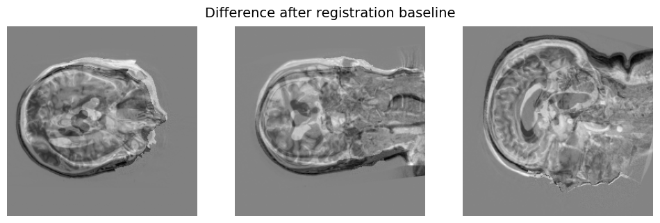
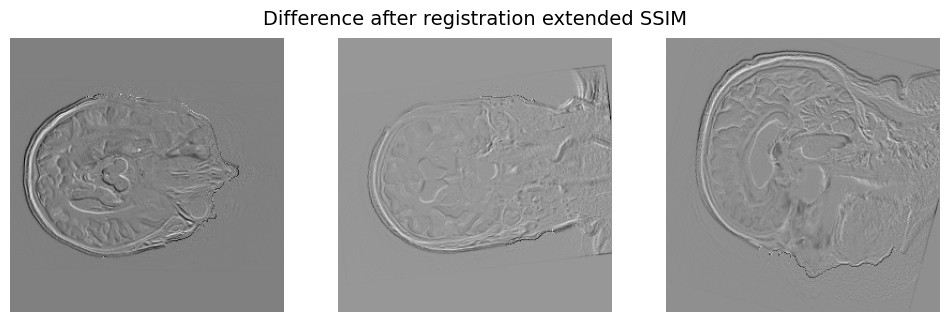

# VoxelMorph Extension for 3D Medical Image Registration

This repository contains a modified version of **VoxelMorph**, a deep learning framework for deformable medical image registration. VoxelMorph leverages convolutional neural networks to learn a mapping between moving and fixed images, enabling fast and accurate registration without the need for iterative optimization at inference time. Our extension to the original network includes changing the loss function and provides an option to modify the model by incorporating attention mechanisms either as skip connections or as an additional learning layer in the bottleneck region of the U-Net. Additionally, cyclical learning rate is optional and should be adjusted according to the specific dataset.






## Original VoxelMorph

VoxelMorph is introduced in the following paper:

- **VoxelMorph: A Learning Framework for Deformable Medical Image Registration**  
  G. Balakrishnan, A. Zhao, M. R. Sabuncu, J. Guttag, A.V. Dalca. IEEE Transactions on Medical Imaging, 2019.
- Link to original git repo: [VoxelmMorph]([URL](https://github.com/voxelmorph/voxelmorph))


## Modifications in this Repository

This fork introduces several modifications and enhancements to the original VoxelMorph model:

- Changes and bug fixes addressing third-party package updates, specifically related to the `neurit` package. To ensure compatibility, users should maintain consistency with the recommended `neurit` package version when working with this repository.

1. **SSIM Image Loss:**  
   Added the option to train using **Structural Similarity Index (SSIM)** instead of default MSE or NCC, which better preserves perceptual image quality. There is also an option to combine losses.

2. **Attention Mechanisms:**  
   - **Attention in skip connections:** Implemented attention layers in the U-Net skip connections to allow the network to focus on more relevant features during registration.  
   - **Attention in bottleneck:** Applied attention in the bottleneck of the U-Net to improve feature representation at the most compressed layer.

3. **Training Utilities:**  
   - Added scripts to log per-epoch total loss and learning rate values for easier visualization.  
   - Option to train with **cyclic learning rate scheduler (CyclicLR)** for improved convergence.  

4. **Normalized Input Handling:**  
   Functions for preprocessing and normalizing 3D medical images to [0, 1] range before training.

## Instructions

This section explains how to run the code and the purpose of each file.

### Loading the data
- **File:** `extension/load_data.ipynb`  
- **Purpose:** This notebook is used to download the data that we used in our project.

### Training the Model
- **File:** `extension/train_our_model.ipynb`  
- **Purpose:** This notebook is used to start and run the training of the models.  

### Testing and Evaluation

- **File:** `extension/test.ipynb`  
- **Purpose:** This script allows you to evaluate the trained models both quantitatively and qualitatively.  
- **Features:**  
  - Compute metrics such as MSE before and after registration.  
  - Visualize registered images.  
  - Inspect PCA results and feature maps from the bottleneck layer of the models.  

### Modifications in Python Scripts

- **Loss Functions (`voxelmorph/nn/losses.py`):**  
  - Added **SSIM loss** as an alternative to MSE or NCC.  
  - Added a **combined SSIM + MSE loss** defined as `0.5 * MSE + 0.5 * SSIM` to balance pixel-wise accuracy with perceptual similarity. To change the weights of loss functions please refer to this file.

- **Attention Modules (`voxelmorph/nn/attention.py`):**  
  - Implemented `SelfAttention3D(nn.Module)` for applying attention in the **bottleneck**.  
  - Implemented `SpatialAttention3D(nn.Module)` for applying attention in the **skip connections**.  

- **Custom U-Net (`voxelmorph/nn/custom_unet.py`):**  
  - Introduced `CustomUNet(models.BasicUNet)` subclass.  
  - Modified to support **bottleneck attention** and **skip connection attention**.  
  - Retains compatibility with standard VoxelMorph pipelines.  

- **Training Script (`scripts/train.py`):**  
  - Updated to support **SSIM loss** and **SSIM + MSE** combined loss.  
  - Logs **loss** and **learning rate** values per epoch for visualization.  

- **Models Definition (`voxelmorph/nn/models.py`):**  
  - Switched architecture to `CustomUNet`.  
  - Added flags for enabling **bottleneck attention** and/or **skip connection attention**.  

- **Registration Script (`voxelmorph/nn/register.py`):**  
  - Updated model instantiation to:  
    ```python
    model = vxm_models.VxmDeformable(...)
    ```  
  - Compatible with new loss functions and attention configurations.

- **Utility Functions (`voxelmorph/nn/useful_functions.py`):**  
  - **Normalization:** `normalize(x)` scales volumes to the range `[0, 1]`.  
  - **Visualization:**  
    - `show(im, title=None)` displays three orthogonal slices from a 3D volume.  
    - `visualize_feature_channel(features, channel_index)` plots slices from a specific feature map channel.  
    - `plot_loss_curves(file_paths, labels, ...)` visualizes training loss curves from saved log files.  
  - **Metrics:** `mse(fixed, moving, warped, name)` computes the Mean Squared Error after registration, with optional normalization logic depending on model type.  
  - **Data Handling:**  
    - `load_volume(path)` loads `.npz` volumes.  
    - `save_normalized(input_path)` normalizes a volume and saves it to a `normalized/` subdirectory.  

  - **Add Gaussian Noise (`add_noise.py`):**  
  - Contains a utility function `add_gaussian_noise()` to inject Gaussian noise into image tensors during preprocessing or data augmentation.  

## Requirements

- Python 3.10+
- PyTorch
- Numpy
- Matplotlib
- Voxelmorph (PyTorch backend)
- Other dependencies as listed in `requirements.txt`

## Usage

### Training

```bash
%run -i ../scripts/train.py 
    --img-list train_files.txt 
    --batch-size 2 
    --epochs 25 
    --image-loss ssim
```
### Training Options

- `--img-list`: Text file with line-separated paths to training images.  
- `--batch-size`: Number of image pairs per batch.  
- `--epochs`: Total number of training epochs.  
- `--image-loss`: Loss function to use (`mse`, `ncc`, `ssim`, `ssim_mse`).  

### Logging and Visualization

- Loss history is saved in `models/loss_history.txt`.  
- Learning rate history is saved in `models/lr_history.txt`.  
- You can plot the loss or learning rate curves using matplotlib.

### Model Saving

- The final model is saved as `models/{number of epochs}.pt`.  

- Intermediate checkpoints are saved every 20 epochs.


